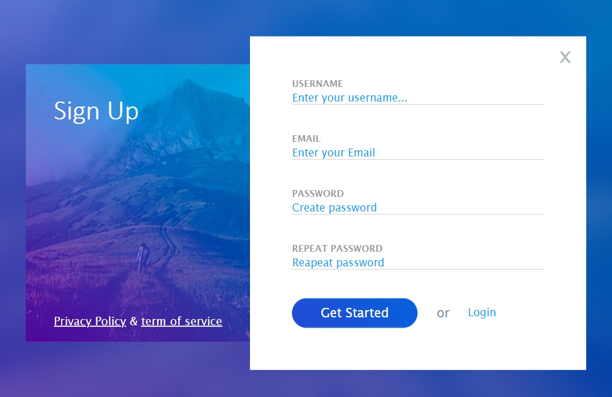
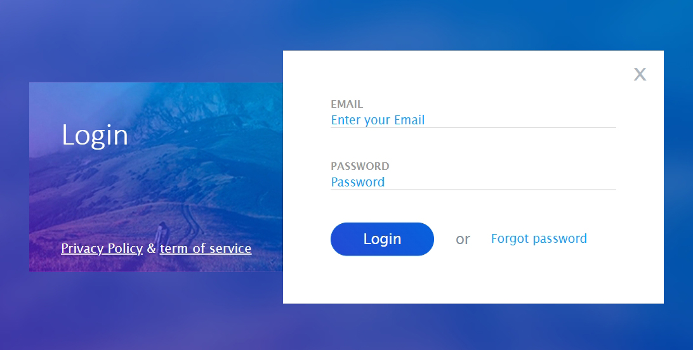
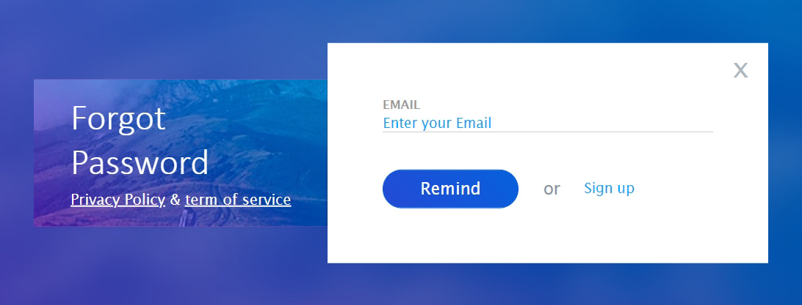

# Sign up

 
 

Loging form with working button links to 
 __Sign up &129094 Login 129094 Forgot__ Password pages
 was created to learn basic form creation

Design: https://bit.ly/34jO6w4

Site published at: https://mantodinas.github.io/Mountains-Sign-Up/

Created by Mantas Petrauskas 
 more projects https://github.com/mantodinas

